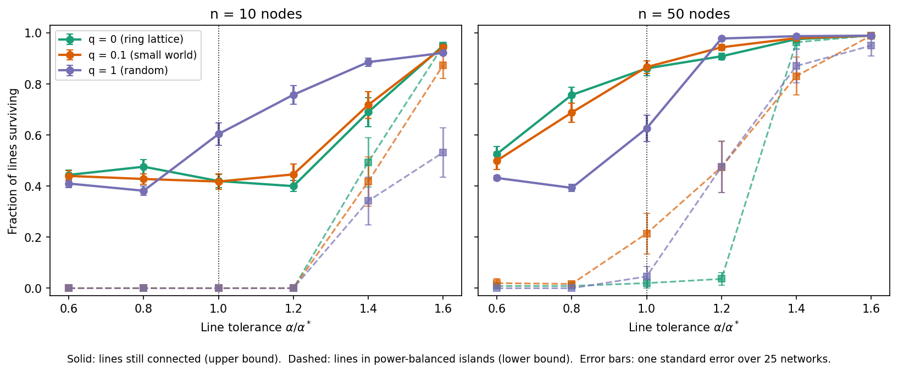
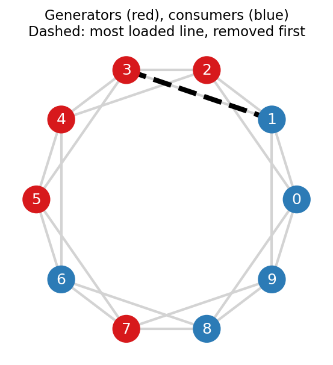
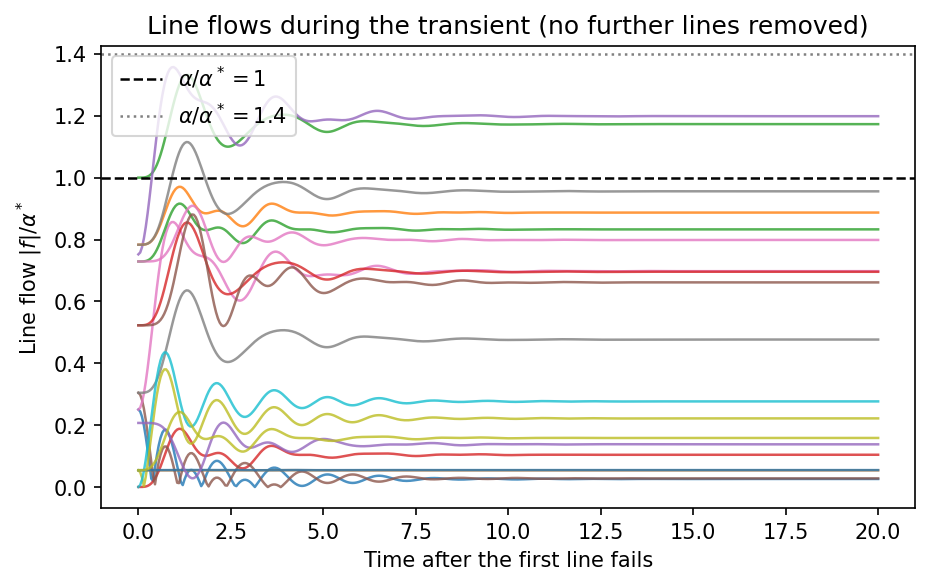

# Cascading Failures in Power Grids: A Dynamic Simulation

When a heavily loaded power line fails, its power has to reroute through the rest of the grid. That can overload other lines, which trip in turn, spreading a single fault into a wider outage. This project simulates that process to ask how much spare line capacity a grid needs to contain a failure, and whether the network's structure makes a difference.

The cascade is simulated **dynamically**. After each failure, the swing equations are integrated through the transient, and a line trips the moment its flow exceeds capacity. This captures temporary overshoots in flow that a static power-flow calculation misses.

**[Read the full analysis, with code and figures →](cascading_failures.ipynb)**

*This was my contribution to a six-person group project on renewable-integrated microgrid stability. The code and analysis in this repository are my own work.*

## Key findings

From 900 simulated cascades across two network sizes, three network structures and six line-capacity levels:

- **Lines need 40–60% spare capacity to stop a cascade.** Even when every line can carry 20% more than the largest normal flow, the failure of the most loaded line still spreads in most networks. There are two reasons. Once rerouted, the new steady flows exceed the old maximum, and during the transient they briefly overshoot further. In the worked example, flows settle at 1.20× the old maximum but peak at 1.36×.
- **Counting intact lines overstates how much of the grid survives.** In 50-node ring networks with 20% spare capacity, about 91% of lines stay connected, but only about 4% are in islands whose generation and demand still balance. The rest are in islands that can't hold frequency without outside support.
- **Whether structure helps depends on how stressed the lines are.** With tight capacity, ordered ring networks keep more lines connected than random ones (76% against 39%). With more headroom the order reverses (98% for random against 91% for rings).
- **Larger networks absorb a single failure better.** With 20% spare capacity, 50-node networks keep 91–98% of lines connected, against 40–76% for 10-node networks.
- **Tight capacity produces long, drawn-out cascades,** averaging up to 36 rounds of one or two failures each.



*Solid lines: fraction of lines still connected (upper bound). Dashed lines: fraction in islands whose power still balances (lower bound). A real grid lies between the two, depending on its frequency control.*

**Why capacity above the normal maximum isn't enough.** After the most loaded line (dashed, below left) fails, the remaining flows overshoot during the transient (below right).

<p>


</p>

## Approach

| Step | Method |
|:--|:--|
| Network | Watts–Strogatz graphs with rewiring probability q: 0 (ordered ring), 0.1 (small world), 1 (random) |
| Power | Equal numbers of generators (+1) and consumers (−1) |
| Dynamics | Second-order swing equations, integrated with SciPy's `solve_ivp` |
| Trigger | Remove the most loaded line in the synchronised steady state |
| Cascade | Trip any line whose flow exceeds its capacity at any moment, then restart from that moment. Repeat until no further failures |
| Resilience | Two bounds: lines still connected, and lines in power-balanced islands |
| Sweep | 2 sizes × 3 structures × 6 capacity levels × 25 random networks |

## Running the notebook

```bash
pip install -r requirements.txt
jupyter notebook cascading_failures.ipynb
```

The full sweep takes 15–20 minutes on one CPU core, so the results are saved in `results/cascade_sweep.csv` and the notebook loads them. Delete that file to recompute everything from scratch.

## Limitations

- All nodes have the same power magnitude, damping and coupling, and there is no real grid data.
- The model has no frequency control or protection schemes, such as load shedding or controlled islanding.
- The sweep uses 25 networks per setting and two network sizes. Differences smaller than about 0.1 in the surviving fraction are within run-to-run noise.

## Repository contents

| File | Contents |
|:--|:--|
| `cascading_failures.ipynb` | Full analysis: model, worked example, sweep and findings |
| `results/cascade_sweep.csv` | Saved results of all 900 simulations |
| `figures/` | Figures generated by the notebook |
| `requirements.txt` | Python packages needed to run it |
